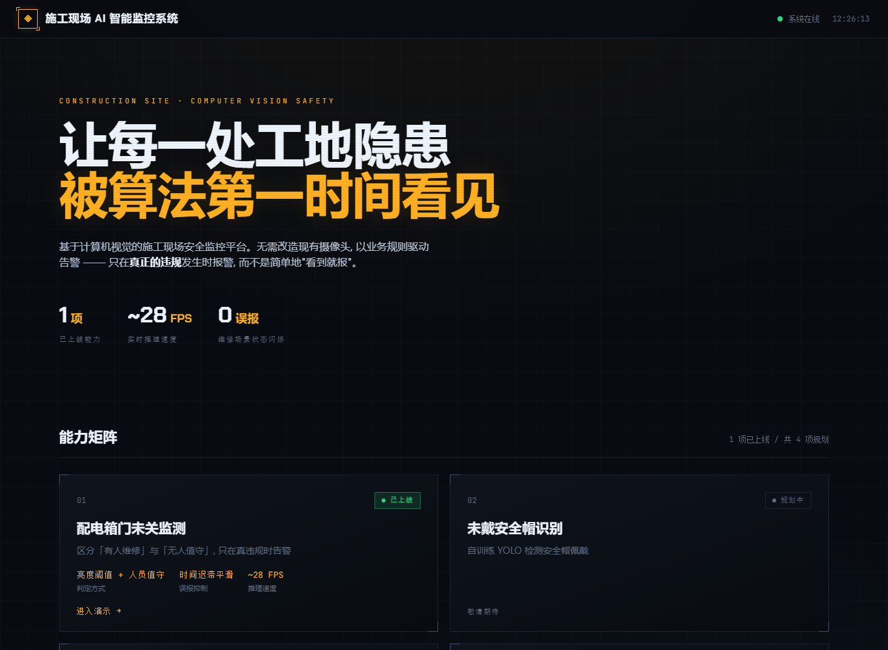
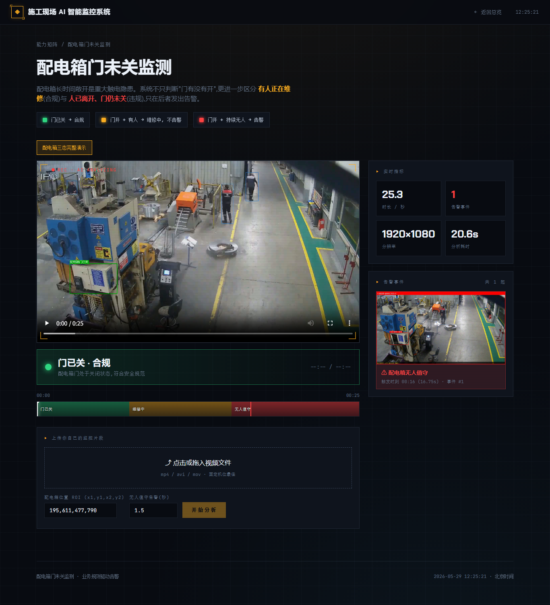

# 施工现场 AI 智能监控系统

基于计算机视觉的施工现场安全监控平台。无需改造现有摄像头,以**业务规则驱动告警**——
只在真正的违规发生时报警,而不是"看到就报"。

本仓库是一个**可扩展的功能平台**:已上线 **配电箱门未关监测** 与 **危险区域闯入** 两个模块,
其他开发者可按下方《新增功能模块》指南,在同一个网站上挂载新的检测能力。





---

## 快速开始

本项目用 [**uv**](https://docs.astral.sh/uv/) 管理依赖 —— 一条命令装好一切,
**不污染你电脑的全局 Python 环境**,连 Python 解释器都由 uv 自动准备。

### 1. 装 uv(只需一次)

```bash
# Windows (PowerShell)
powershell -ExecutionPolicy ByPass -c "irm https://astral.sh/uv/install.ps1 | iex"
# macOS / Linux
curl -LsSf https://astral.sh/uv/install.sh | sh
```

### 2. 同步依赖

在项目目录下:

```bash
uv sync
```

uv 会自动:下载合适的 Python、创建项目专属 `.venv`、按 `uv.lock` 装好全部依赖
(默认 **CPU 版 PyTorch**,任何机器都能装上即跑)。

### 3. 启动网站

```bash
uv run uvicorn webapp.server:app --host 127.0.0.1 --port 8000
```

浏览器打开 **http://127.0.0.1:8000**

> 首次启动会自动用内置样本视频生成一次演示结果(CPU 上约 1–3 分钟,GPU 数十秒,仅首次);
> 之后秒开。人体检测模型 `yolov8n.pt` 已随仓库提供。

### 4. 命令行直接出标注视频(可选)

```bash
uv run python run_panel.py --video data/samples/panel_storyline.mp4 --panel_roi "195,611,477,790" --out demo
# 输出: runs/demo/annotated.mp4 + events.json
```

### GPU 加速(可选)

默认装的是 CPU 版 PyTorch,通用但较慢。若你有 NVIDIA 显卡,想用 GPU 加速,
把 `pyproject.toml` 里 `[[tool.uv.index]]` 的 url 改成对应 CUDA 版本后重新 `uv sync`,例如:

```toml
[[tool.uv.index]]
name = "pytorch-cpu"        # 名字可不改
url = "https://download.pytorch.org/whl/cu121"   # 改成你的 CUDA 版本: cu121 / cu124 / cu128 ...
explicit = true
```

> 不用 uv 也行:本仓库保留了 `requirements.txt`,可走传统 `pip install -r requirements.txt`。

---

## 配电箱模块的业务逻辑

配电箱长时间敞开是重大触电隐患,但"门开着"本身不一定违规。本模块分三态:

| 状态 | 含义 | 处理 |
|---|---|---|
| 🟢 门已关 | 合规 | 不告警 |
| 🟡 门开 + 有人 | 维修中,人员值守 | 不告警 |
| 🔴 门开 + 持续无人 | 无人值守 | **告警** |

关键实现:
- **门开/关**:对配电箱 ROI 区域算灰度均值,低于阈值=露出黑色内部=门开(无需训练模型)。
- **维修中 / 无人值守**:门框周围扩出"安全区",看是否有人体落在其中。
- **防闪烁**:`PanelStateSmoother` 时间迟滞——有人出现后保持"维修中"一个宽限期,
  吸收人体漏检/短暂走开,避免状态在黄/红之间抖动。

> ⚠️ ROI 坐标 `195,611,477,790` 是针对内置样本(1920×1080 固定机位)标定的。
> 换摄像头需重新标定 ROI 和阈值。

---

## 危险区域闯入模块的业务逻辑

在固定机位画面上划定多边形**电子围栏**,按区域分级处理,只在真正违规时告警:

| 区域类型 | 颜色 | 人员进入时 |
|---|---|---|
| 🔴 禁区 `no_entry` | 红 | 持续停留 → **告警** |
| 🟡 警戒区 `approach_warning` | 黄 | 仅提示, 不告警 |
| 🟢 监控区 `general` | 青 | 仅画区域 |

关键实现:
- **归属判定**:取人体框的**脚底中点**判断是否落入某区域(站地面区域比用框中心更准),
  `RoiZone.contains` 用 `cv2.pointPolygonTest` 做点-多边形判定。
- **防误报**:人员在禁区内**持续 N 秒**(`persist_alert`)才正式告警,`ViolationTracker`
  做跨帧跟踪去抖,路过/一闪而过不报。
- **分级**:警戒区只改状态不进告警队列,避免"靠近即报"的打扰。

命令行直接出标注视频:

```bash
uv run python run_intrusion.py --video data/samples/panel_storyline.mp4 \
    --zone "150,640,820,1080" --name "配电作业危险区" --out intrusion_demo
```

> ROI 坐标随摄像头视角标定;矩形 `x1,y1,x2,y2` 会展开成 4 顶点多边形,
> 需要任意多边形时直接构造 `IntrusionConfig(zones=[RoiZone(...)])`。

---

## 告警动作(事故报告 / 邮件)

检测到告警后,系统可执行告警动作。当前已实现:

- **事故报告 PDF**:含事故概要、自然语言描述、现场证据图、三态时间线、处置建议、数据附录。
  在配电箱页点「生成事故报告」即可下载,或命令行/接口生成。
- **邮件告警**:把报告作为附件、截图内嵌正文,通过 SMTP 发送给指定收件人。
- **浏览器语音播报**:配电箱页播放视频,进度到达告警时刻自动语音提示「注意,请关闭配电箱」
  (Web Speech API,零依赖,状态条右侧可一键开关)。

> 架构上是一个**通用告警层** `src/alerting/`(事件 → 分发器 → 渠道),任何识别模块都能复用。
> 规划中:服务器端喇叭播报、企业微信/钉钉/Bark 手机推送。

### 配置邮件(以 QQ 邮箱为例)

邮件密钥**不入库**。复制模板再填写:

```bash
cp config/alerting.example.yaml config/alerting.yaml
# 然后编辑 config/alerting.yaml 填入授权码(此文件已被 .gitignore)
```

QQ 邮箱要用 **「授权码」**(不是登录密码),获取方式:

1. 电脑浏览器登录 **mail.qq.com**
2. **设置 → 账号**
3. 找到「IMAP/SMTP服务」→ **开启**
4. 按提示**用手机发一条短信**验证
5. 验证后会显示一串 **16 位授权码**,复制填进 `config/alerting.yaml` 的 `smtp_password`

填好后重启服务,配电箱页的「发送到邮箱」按钮即可用。

---

## 项目结构

```
common/
├── run_panel.py              配电箱模块命令行入口
├── run_intrusion.py          危险区域闯入模块命令行入口
├── pyproject.toml / uv.lock  uv 依赖管理
├── yolov8n.pt                人体检测模型(随仓库提供)
├── config/
│   └── alerting.example.yaml 告警渠道配置模板(复制为 alerting.yaml 填密钥)
├── data/samples/             内置演示样本(源视频 + samples.json 清单, 含 module 字段)
├── webapp/
│   ├── server.py             FastAPI 后端(API + 静态托管 + 后台分析)
│   ├── media.py              mp4v → H.264 转码(浏览器播放)
│   └── static/               前端(index 首页 / panel / intrusion 模块页 / css / js)
├── src/
│   ├── types.py              Detection / Violation / Alert 数据结构
│   ├── visualizer.py         画框 + 中文渲染 + HUD + 多色 ROI
│   ├── detectors/            base / person / panel_door
│   ├── rules/                通用基建: geometry / roi(RoiZone) / tracker
│   ├── alerting/             告警动作层: 事件/报告/邮件/分发器(通用, 各模块复用)
│   └── modules/
│       ├── panel/            ★ 配电箱模块(自包含: config/detector/rules/pipeline/incident)
│       └── intrusion/        ★ 危险区域闯入模块(自包含: config/rules/pipeline/incident)
└── runs/                     运行产物(gitignore, 不入库)
```

---

## 新增功能模块(给协作开发者)

平台按"**一个功能 = 一个自包含模块**"组织。新增能力(如安全帽、吸烟)的步骤:

### 第 1 步:建模块

在 `src/modules/` 下新建子包,例如 `src/modules/helmet/`,内含:

- `config.py` —— 一个 `dataclass` 收纳全部参数
- `pipeline.py` —— 一个类,实现:

  ```python
  def process_video(self, video_in, out_dir, progress_cb=None) -> dict
  ```

  在 `out_dir` 写出 `annotated.mp4`、`events.json`、`violations/*.jpg`,
  并返回 summary 字典。**为了能接入网站**,`events.json` 至少包含:

  ```jsonc
  {
    "module": "helmet",
    "fps": 25.0, "width": 1920, "height": 1080, "total_frames": 600,
    "elapsed_seconds": 20.0,
    "n_alerts": 3,
    "cumulative": { "...": 0 },
    "alerts": [ { "kind": "...", "track_id": 1, "frame_idx": 100,
                  "time_seconds": 4.0, "screenshot": "alert_xxx.jpg" } ],
    "timeline": ["...", "..."]   // 可选: 逐帧状态, 用于网站时间轴
  }
  ```

  可直接复用共享基建:`src.detectors.PersonDetector`、`src.rules.ViolationTracker`、
  `src.visualizer` 的画框函数。**不要**在模块里耦合其它模块的逻辑。

### 第 2 步:注册到网站(`webapp/server.py`, 几处登记)

平台已把"按模块分派"做成了几个**登记表**,新增模块只在这些表里加一行,互不影响:

1. **`MODULES`** —— 把你的卡片状态改成 `online` 并给 `href`:

   ```python
   {"id": "helmet", "name": "未戴安全帽识别", "tagline": "...",
    "status": "online", "metrics": [...], "href": "/helmet"},
   ```

2. **`build_pipeline_for_sample`** —— 加一个分支,让内置样本能预渲染:

   ```python
   if module == "helmet":
       return HelmetPipeline(HelmetConfig(...))
   ```

3. **`EVENT_BUILDERS`** —— 登记你的 `build_xxx_event`(报告/邮件就自动支持你的模块):

   ```python
   EVENT_BUILDERS = {"panel": ..., "intrusion": ..., "helmet": build_helmet_event}
   ```

4. **`STATE_CN`** —— 若有自定义逐帧状态, 加上中文名(网站时间轴/状态条用)。

### 第 3 步:加接口 + 页面

- **样本**:在 `data/samples/samples.json` 加一条带 `"module": "helmet"` 的样本。
  前端用 `/api/samples?module=helmet` 取本模块样本,各模块不串台。
- **上传分析**:参照 `/api/intrusion/analyze` 加一个你的 analyze 接口(内部用通用
  `_run_job` 跑 `process_video`);结果直接复用 `/api/result/{run}`,报告复用 `/api/report`。
- **页面**:复制 `webapp/static/intrusion.html` + `js/intrusion.js` + `css/intrusion.css`
  作模板改成你的功能页(CSS 自包含, 删除模块时一并删掉即可)。

完成后,首页能力矩阵会自动把你的卡片显示为"已上线"并可点进。**删除一个模块** =
删掉 `src/modules/<name>/` + 前端三件套 + 上面几处登记行,不影响其它模块。

---

## API

| 方法 | 路径 | 说明 |
|---|---|---|
| GET | `/` | 首页 · 能力矩阵 |
| GET | `/panel` · `/intrusion` | 各模块演示页 |
| GET | `/api/modules` | 功能模块清单 |
| GET | `/api/samples?module=` | 内置演示样本(按模块过滤) |
| GET | `/api/result/{run}` | 某次分析结果(时间轴 / 告警 / 视频地址, 通用) |
| POST | `/api/panel/analyze` | 配电箱:上传视频 → 后台分析,返回 `job_id` |
| POST | `/api/intrusion/analyze` | 危险区域闯入:上传视频 → 后台分析,返回 `job_id` |
| GET | `/api/jobs/{job_id}` | 轮询分析进度(通用) |
| GET | `/api/alerting/status` | 各告警渠道是否已配置可用 |
| POST | `/api/report` | 生成事故报告 PDF(按 run 所属模块自动选模板) |
| POST | `/api/alerting/send` | 生成报告并通过已启用渠道(邮件)发送(通用) |
